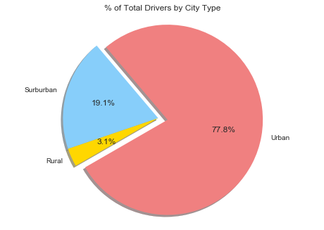

```python
import pandas as pd
import numpy as np
import matplotlib.pyplot as plt
import seaborn as sns
```


```python
city_data = pd.read_csv("raw_data/city_data.csv")
ride_data = pd.read_csv("raw_data/ride_data.csv")
```


```python
city_data.head()
```


<div>
<style>
    .dataframe thead tr:only-child th {
        text-align: right;
    }

    .dataframe thead th {
        text-align: left;
    }

    .dataframe tbody tr th {
        vertical-align: top;
    }
</style>
<table border="1" class="dataframe">
  <thead>
    <tr style="text-align: right;">
      <th></th>
      <th>city</th>
      <th>driver_count</th>
      <th>type</th>
    </tr>
  </thead>
  <tbody>
    <tr>
      <th>0</th>
      <td>Kelseyland</td>
      <td>63</td>
      <td>Urban</td>
    </tr>
    <tr>
      <th>1</th>
      <td>Nguyenbury</td>
      <td>8</td>
      <td>Urban</td>
    </tr>
    <tr>
      <th>2</th>
      <td>East Douglas</td>
      <td>12</td>
      <td>Urban</td>
    </tr>
    <tr>
      <th>3</th>
      <td>West Dawnfurt</td>
      <td>34</td>
      <td>Urban</td>
    </tr>
    <tr>
      <th>4</th>
      <td>Rodriguezburgh</td>
      <td>52</td>
      <td>Urban</td>
    </tr>
  </tbody>
</table>
</div>


```python
ride_data.head()
```


<div>
<style>
    .dataframe thead tr:only-child th {
        text-align: right;
    }

    .dataframe thead th {
        text-align: left;
    }

    .dataframe tbody tr th {
        vertical-align: top;
    }
</style>
<table border="1" class="dataframe">
  <thead>
    <tr style="text-align: right;">
      <th></th>
      <th>city</th>
      <th>date</th>
      <th>fare</th>
      <th>ride_id</th>
    </tr>
  </thead>
  <tbody>
    <tr>
      <th>0</th>
      <td>Sarabury</td>
      <td>2016-01-16 13:49:27</td>
      <td>38.35</td>
      <td>5403689035038</td>
    </tr>
    <tr>
      <th>1</th>
      <td>South Roy</td>
      <td>2016-01-02 18:42:34</td>
      <td>17.49</td>
      <td>4036272335942</td>
    </tr>
    <tr>
      <th>2</th>
      <td>Wiseborough</td>
      <td>2016-01-21 17:35:29</td>
      <td>44.18</td>
      <td>3645042422587</td>
    </tr>
    <tr>
      <th>3</th>
      <td>Spencertown</td>
      <td>2016-07-31 14:53:22</td>
      <td>6.87</td>
      <td>2242596575892</td>
    </tr>
    <tr>
      <th>4</th>
      <td>Nguyenbury</td>
      <td>2016-07-09 04:42:44</td>
      <td>6.28</td>
      <td>1543057793673</td>
    </tr>
  </tbody>
</table>
</div>


```python
pyber_data = pd.merge(ride_data, city_data, how="left", on=["city"])
pyber_data.head()
```


<div>
<style>
    .dataframe thead tr:only-child th {
        text-align: right;
    }

    .dataframe thead th {
        text-align: left;
    }

    .dataframe tbody tr th {
        vertical-align: top;
    }
</style>
<table border="1" class="dataframe">
  <thead>
    <tr style="text-align: right;">
      <th></th>
      <th>city</th>
      <th>date</th>
      <th>fare</th>
      <th>ride_id</th>
      <th>driver_count</th>
      <th>type</th>
    </tr>
  </thead>
  <tbody>
    <tr>
      <th>0</th>
      <td>Sarabury</td>
      <td>2016-01-16 13:49:27</td>
      <td>38.35</td>
      <td>5403689035038</td>
      <td>46</td>
      <td>Urban</td>
    </tr>
    <tr>
      <th>1</th>
      <td>South Roy</td>
      <td>2016-01-02 18:42:34</td>
      <td>17.49</td>
      <td>4036272335942</td>
      <td>35</td>
      <td>Urban</td>
    </tr>
    <tr>
      <th>2</th>
      <td>Wiseborough</td>
      <td>2016-01-21 17:35:29</td>
      <td>44.18</td>
      <td>3645042422587</td>
      <td>55</td>
      <td>Urban</td>
    </tr>
    <tr>
      <th>3</th>
      <td>Spencertown</td>
      <td>2016-07-31 14:53:22</td>
      <td>6.87</td>
      <td>2242596575892</td>
      <td>68</td>
      <td>Urban</td>
    </tr>
    <tr>
      <th>4</th>
      <td>Nguyenbury</td>
      <td>2016-07-09 04:42:44</td>
      <td>6.28</td>
      <td>1543057793673</td>
      <td>8</td>
      <td>Urban</td>
    </tr>
  </tbody>
</table>
</div>


```python
pyber_data_rural = pyber_data.loc[(pyber_data["type"] == "Rural")]
pyber_data_rural.head()
```


<div>
<style>
    .dataframe thead tr:only-child th {
        text-align: right;
    }

    .dataframe thead th {
        text-align: left;
    }

    .dataframe tbody tr th {
        vertical-align: top;
    }
</style>
<table border="1" class="dataframe">
  <thead>
    <tr style="text-align: right;">
      <th></th>
      <th>city</th>
      <th>date</th>
      <th>fare</th>
      <th>ride_id</th>
      <th>driver_count</th>
      <th>type</th>
    </tr>
  </thead>
  <tbody>
    <tr>
      <th>2282</th>
      <td>Horneland</td>
      <td>2016-07-19 10:07:33</td>
      <td>12.63</td>
      <td>8214498891817</td>
      <td>8</td>
      <td>Rural</td>
    </tr>
    <tr>
      <th>2283</th>
      <td>Kinghaven</td>
      <td>2016-05-18 23:28:12</td>
      <td>20.53</td>
      <td>6432117120069</td>
      <td>3</td>
      <td>Rural</td>
    </tr>
    <tr>
      <th>2284</th>
      <td>New Johnbury</td>
      <td>2016-04-21 08:30:25</td>
      <td>56.60</td>
      <td>9002881309143</td>
      <td>6</td>
      <td>Rural</td>
    </tr>
    <tr>
      <th>2285</th>
      <td>South Joseph</td>
      <td>2016-02-17 01:41:29</td>
      <td>57.52</td>
      <td>7365786843443</td>
      <td>3</td>
      <td>Rural</td>
    </tr>
    <tr>
      <th>2286</th>
      <td>Kennethburgh</td>
      <td>2016-10-19 13:13:17</td>
      <td>24.43</td>
      <td>2728236352387</td>
      <td>3</td>
      <td>Rural</td>
    </tr>
  </tbody>
</table>
</div>


```python
pyber_data_rural_avg_fare = pyber_data_rural.groupby("city").mean()["fare"]
pyber_data_rural_avg_fare = pd.DataFrame(pyber_data_rural_avg_fare)
```


```python
pyber_data_rural_rides = pyber_data_rural['city'].value_counts()
pyber_data_rural_rides = pd.DataFrame(pyber_data_rural_rides)
pyber_data_rural_rides.index.name = 'city'
pyber_data_rural_rides.rename(columns={'city' : 'ride_count'}, inplace=True)
```


```python
pyber_data_rural_drivers = city_data.loc[(city_data["type"] == "Rural")].set_index("city").iloc[:,0]
pyber_data_rural_drivers = pd.DataFrame(pyber_data_rural_drivers)
```


```python
clean_pyber_data_rural = pd.merge(pyber_data_rural_avg_fare, pyber_data_rural_rides, how='outer', left_index=True, right_index=True)
```


```python
clean_pyber_data_rural = pd.merge(clean_pyber_data_rural, pyber_data_rural_drivers, how='outer', left_index=True, right_index=True)
```


```python
clean_pyber_data_rural.rename(columns={'fare' : 'avg_fare'}, inplace=True)
clean_pyber_data_rural.head()
```


<div>
<style>
    .dataframe thead tr:only-child th {
        text-align: right;
    }

    .dataframe thead th {
        text-align: left;
    }

    .dataframe tbody tr th {
        vertical-align: top;
    }
</style>
<table border="1" class="dataframe">
  <thead>
    <tr style="text-align: right;">
      <th></th>
      <th>avg_fare</th>
      <th>ride_count</th>
      <th>driver_count</th>
    </tr>
    <tr>
      <th>city</th>
      <th></th>
      <th></th>
      <th></th>
    </tr>
  </thead>
  <tbody>
    <tr>
      <th>East Leslie</th>
      <td>33.660909</td>
      <td>11</td>
      <td>9</td>
    </tr>
    <tr>
      <th>East Stephen</th>
      <td>39.053000</td>
      <td>10</td>
      <td>6</td>
    </tr>
    <tr>
      <th>East Troybury</th>
      <td>33.244286</td>
      <td>7</td>
      <td>3</td>
    </tr>
    <tr>
      <th>Erikport</th>
      <td>30.043750</td>
      <td>8</td>
      <td>3</td>
    </tr>
    <tr>
      <th>Hernandezshire</th>
      <td>32.002222</td>
      <td>9</td>
      <td>10</td>
    </tr>
  </tbody>
</table>
</div>


```python
pyber_data_urban = pyber_data.loc[(pyber_data["type"] == "Urban")]
pyber_data_urban.head()
```


<div>
<style>
    .dataframe thead tr:only-child th {
        text-align: right;
    }

    .dataframe thead th {
        text-align: left;
    }

    .dataframe tbody tr th {
        vertical-align: top;
    }
</style>
<table border="1" class="dataframe">
  <thead>
    <tr style="text-align: right;">
      <th></th>
      <th>city</th>
      <th>date</th>
      <th>fare</th>
      <th>ride_id</th>
      <th>driver_count</th>
      <th>type</th>
    </tr>
  </thead>
  <tbody>
    <tr>
      <th>0</th>
      <td>Sarabury</td>
      <td>2016-01-16 13:49:27</td>
      <td>38.35</td>
      <td>5403689035038</td>
      <td>46</td>
      <td>Urban</td>
    </tr>
    <tr>
      <th>1</th>
      <td>South Roy</td>
      <td>2016-01-02 18:42:34</td>
      <td>17.49</td>
      <td>4036272335942</td>
      <td>35</td>
      <td>Urban</td>
    </tr>
    <tr>
      <th>2</th>
      <td>Wiseborough</td>
      <td>2016-01-21 17:35:29</td>
      <td>44.18</td>
      <td>3645042422587</td>
      <td>55</td>
      <td>Urban</td>
    </tr>
    <tr>
      <th>3</th>
      <td>Spencertown</td>
      <td>2016-07-31 14:53:22</td>
      <td>6.87</td>
      <td>2242596575892</td>
      <td>68</td>
      <td>Urban</td>
    </tr>
    <tr>
      <th>4</th>
      <td>Nguyenbury</td>
      <td>2016-07-09 04:42:44</td>
      <td>6.28</td>
      <td>1543057793673</td>
      <td>8</td>
      <td>Urban</td>
    </tr>
  </tbody>
</table>
</div>


```python
pyber_data_urban_avg_fare = pyber_data_urban.groupby("city").mean()["fare"]
pyber_data_urban_avg_fare = pd.DataFrame(pyber_data_urban_avg_fare)
```


```python
pyber_data_urban_rides = pyber_data_urban['city'].value_counts()
pyber_data_urban_rides = pd.DataFrame(pyber_data_urban_rides)
pyber_data_urban_rides.index.name = 'city'
pyber_data_urban_rides.rename(columns={'city' : 'ride_count'}, inplace=True)
```


```python
pyber_data_urban_drivers = city_data.loc[(city_data["type"] == "Urban")].set_index("city").iloc[:,0]
pyber_data_urban_drivers = pd.DataFrame(pyber_data_urban_drivers)
```


```python
clean_pyber_data_urban = pd.merge(pyber_data_urban_avg_fare, pyber_data_urban_rides, how='outer', left_index=True, right_index=True)
```


```python
clean_pyber_data_urban = pd.merge(clean_pyber_data_urban, pyber_data_urban_drivers, how='outer', left_index=True, right_index=True)
```


```python
clean_pyber_data_urban.rename(columns={'fare' : 'avg_fare'}, inplace=True)
clean_pyber_data_urban.head()
```


<div>
<style>
    .dataframe thead tr:only-child th {
        text-align: right;
    }

    .dataframe thead th {
        text-align: left;
    }

    .dataframe tbody tr th {
        vertical-align: top;
    }
</style>
<table border="1" class="dataframe">
  <thead>
    <tr style="text-align: right;">
      <th></th>
      <th>avg_fare</th>
      <th>ride_count</th>
      <th>driver_count</th>
    </tr>
    <tr>
      <th>city</th>
      <th></th>
      <th></th>
      <th></th>
    </tr>
  </thead>
  <tbody>
    <tr>
      <th>Alvarezhaven</th>
      <td>23.928710</td>
      <td>31</td>
      <td>21</td>
    </tr>
    <tr>
      <th>Alyssaberg</th>
      <td>20.609615</td>
      <td>26</td>
      <td>67</td>
    </tr>
    <tr>
      <th>Antoniomouth</th>
      <td>23.625000</td>
      <td>22</td>
      <td>21</td>
    </tr>
    <tr>
      <th>Aprilchester</th>
      <td>21.981579</td>
      <td>19</td>
      <td>49</td>
    </tr>
    <tr>
      <th>Arnoldview</th>
      <td>25.106452</td>
      <td>31</td>
      <td>41</td>
    </tr>
  </tbody>
</table>
</div>


```python
pyber_data_suburban = pyber_data.loc[(pyber_data["type"] == "Suburban")]
pyber_data_suburban.head()
pyber_data_suburban_avg_fare = pyber_data_suburban.groupby("city").mean()["fare"]
pyber_data_suburban_avg_fare = pd.DataFrame(pyber_data_suburban_avg_fare)
pyber_data_suburban_rides = pyber_data_suburban['city'].value_counts()
pyber_data_suburban_rides = pd.DataFrame(pyber_data_suburban_rides)
pyber_data_suburban_rides.index.name = 'city'
pyber_data_suburban_rides.rename(columns={'city' : 'ride_count'}, inplace=True)
pyber_data_suburban_drivers = city_data.loc[(city_data["type"] == "Suburban")].set_index("city").iloc[:,0]
pyber_data_suburban_drivers = pd.DataFrame(pyber_data_suburban_drivers)
clean_pyber_data_suburban = pd.merge(pyber_data_suburban_avg_fare, pyber_data_suburban_rides, how='outer', left_index=True, right_index=True)
clean_pyber_data_suburban = pd.merge(clean_pyber_data_suburban, pyber_data_suburban_drivers, how='outer', left_index=True, right_index=True)
clean_pyber_data_suburban.rename(columns={'fare' : 'avg_fare'}, inplace=True)
clean_pyber_data_suburban.head()
```


<div>
<style>
    .dataframe thead tr:only-child th {
        text-align: right;
    }

    .dataframe thead th {
        text-align: left;
    }

    .dataframe tbody tr th {
        vertical-align: top;
    }
</style>
<table border="1" class="dataframe">
  <thead>
    <tr style="text-align: right;">
      <th></th>
      <th>avg_fare</th>
      <th>ride_count</th>
      <th>driver_count</th>
    </tr>
    <tr>
      <th>city</th>
      <th></th>
      <th></th>
      <th></th>
    </tr>
  </thead>
  <tbody>
    <tr>
      <th>Anitamouth</th>
      <td>37.315556</td>
      <td>9</td>
      <td>16</td>
    </tr>
    <tr>
      <th>Campbellport</th>
      <td>33.711333</td>
      <td>15</td>
      <td>26</td>
    </tr>
    <tr>
      <th>Carrollbury</th>
      <td>36.606000</td>
      <td>10</td>
      <td>4</td>
    </tr>
    <tr>
      <th>Clarkstad</th>
      <td>31.051667</td>
      <td>12</td>
      <td>21</td>
    </tr>
    <tr>
      <th>Conwaymouth</th>
      <td>34.591818</td>
      <td>11</td>
      <td>18</td>
    </tr>
  </tbody>
</table>
</div>


```python
x_rural = clean_pyber_data_rural['ride_count']
x_urban = clean_pyber_data_urban['ride_count']
x_suburban = clean_pyber_data_suburban['ride_count']

y_rural = clean_pyber_data_rural['avg_fare']
y_urban = clean_pyber_data_urban['avg_fare']
y_suburban = clean_pyber_data_suburban['avg_fare']

s_rural = clean_pyber_data_rural['driver_count']
s_urban = clean_pyber_data_urban['driver_count']
s_suburban = clean_pyber_data_suburban['driver_count']

rural = plt.scatter(x_rural, y_rural, s_rural, c='gold', linewidths=1, edgecolors="black")
urban = plt.scatter(x_urban, y_urban, s_urban, c='coral', linewidths=1, edgecolors="black")
suburban = plt.scatter(x_suburban, y_suburban, s_suburban, c='lightblue', linewidths=1, edgecolors="black")

plt.title("Pyber Ride Sharing Data (2016)")
plt.xlabel("Total Number of Rides (Per City)")
plt.ylabel("Average Fare ($)")
plt.legend((rural, urban, suburban), 
           ('Rural','Urban','Suburban'),
           title = "City Type")
sns.set
plt.show()
```


## % of Total Drivers by City Type


```python
total_drivers = pyber_data.groupby('type').sum()['driver_count']
total_drivers = pd.DataFrame(total_drivers)
total_drivers
```


<div>
<style>
    .dataframe thead tr:only-child th {
        text-align: right;
    }

    .dataframe thead th {
        text-align: left;
    }

    .dataframe tbody tr th {
        vertical-align: top;
    }
</style>
<table border="1" class="dataframe">
  <thead>
    <tr style="text-align: right;">
      <th></th>
      <th>driver_count</th>
    </tr>
    <tr>
      <th>type</th>
      <th></th>
    </tr>
  </thead>
  <tbody>
    <tr>
      <th>Rural</th>
      <td>727</td>
    </tr>
    <tr>
      <th>Suburban</th>
      <td>9730</td>
    </tr>
    <tr>
      <th>Urban</th>
      <td>64501</td>
    </tr>
  </tbody>
</table>
</div>


```python
total_drivers_urban = (city_data.loc[city_data["type"] == "Urban"]).sum()["driver_count"]
total_drivers_suburban = (city_data.loc[city_data["type"] == "Suburban"]).sum()["driver_count"]
total_drivers_rural = (city_data.loc[city_data["type"] == "Rural"]).sum()["driver_count"]
```


```python
total_drivers_pie_labels = ["Urban", "Surburban", "Rural"]
total_drivers_pie_sizes = [total_drivers_urban, total_drivers_suburban, total_drivers_rural]
total_drivers_pie_colors = ["lightcoral", "lightskyblue", "gold"]
total_drivers_pie_explode = (0.1, 0, 0)
plt.pie(total_drivers_pie_sizes, 
        explode=total_drivers_pie_explode, 
        labels=total_drivers_pie_labels, 
        colors=total_drivers_pie_colors,
        autopct="%1.1f%%", shadow=True, startangle=210)
plt.axis("equal")
plt.title('% of Total Drivers by City Type')
plt.show()
```





## % of Total Rides by City Type


```python
total_rides = pyber_data.groupby("type").size().to_frame(name='total_rides')
total_rides
```


<div>
<style>
    .dataframe thead tr:only-child th {
        text-align: right;
    }

    .dataframe thead th {
        text-align: left;
    }

    .dataframe tbody tr th {
        vertical-align: top;
    }
</style>
<table border="1" class="dataframe">
  <thead>
    <tr style="text-align: right;">
      <th></th>
      <th>total_rides</th>
    </tr>
    <tr>
      <th>type</th>
      <th></th>
    </tr>
  </thead>
  <tbody>
    <tr>
      <th>Rural</th>
      <td>125</td>
    </tr>
    <tr>
      <th>Suburban</th>
      <td>657</td>
    </tr>
    <tr>
      <th>Urban</th>
      <td>1625</td>
    </tr>
  </tbody>
</table>
</div>


```python
total_rides_urban = total_rides.iloc[2]
total_rides_suburban = total_rides.iloc[1]
total_rides_rural = total_rides.iloc[0]
```


    counts    1625
    Name: Urban, dtype: int64


```python
total_rides_pie_labels = ["Urban", "Surburban", "Rural"]
total_rides_pie_sizes = [total_rides_urban, total_rides_suburban, total_rides_rural]
total_rides_pie_colors = ["lightcoral", "lightskyblue", "gold"]
total_rides_pie_explode = (0.1, 0, 0)
plt.pie(total_rides_pie_sizes, 
        explode=total_rides_pie_explode, 
        labels=total_rides_pie_labels, 
        colors=total_rides_pie_colors,
        autopct="%1.1f%%", shadow=True, startangle=210)
plt.axis("equal")
plt.title('% of Total Rides by City Type')
plt.show()
```


## % of Total Fares by City Type


```python
total_fares = pyber_data.groupby(['type']).sum()['fare'] 
total_fares = pd.DataFrame(total_fares)
total_fares
```


<div>
<style>
    .dataframe thead tr:only-child th {
        text-align: right;
    }

    .dataframe thead th {
        text-align: left;
    }

    .dataframe tbody tr th {
        vertical-align: top;
    }
</style>
<table border="1" class="dataframe">
  <thead>
    <tr style="text-align: right;">
      <th></th>
      <th>fare</th>
    </tr>
    <tr>
      <th>type</th>
      <th></th>
    </tr>
  </thead>
  <tbody>
    <tr>
      <th>Rural</th>
      <td>4255.09</td>
    </tr>
    <tr>
      <th>Suburban</th>
      <td>20335.69</td>
    </tr>
    <tr>
      <th>Urban</th>
      <td>40078.34</td>
    </tr>
  </tbody>
</table>
</div>


```python
total_fares_urban = total_fares.iloc[2]
total_fares_suburban = total_fares.iloc[1]
total_fares_rural = total_fares.iloc[0]
```


```python
total_fares_pie_labels = ["Urban", "Surburban", "Rural"]
total_fares_pie_sizes = [total_fares_urban, total_fares_suburban, total_fares_rural]
total_fares_pie_colors = ["lightcoral", "lightskyblue", "gold"]
total_fares_pie_explode = (0.1, 0, 0)
plt.pie(total_fares_pie_sizes, 
        explode=total_fares_pie_explode, 
        labels=total_fares_pie_labels, 
        colors=total_fares_pie_colors,
        autopct="%1.1f%%", shadow=True, startangle=210)
plt.axis("equal")
plt.title('% of Total Fares by City Type')
plt.show()
```


# Conclusion

-Pyber service is heavily used by the Urban sector by a huge margin.    
-While the Urban sector scores higher than Suburban sector in number of rides, the Suburban sector scores higher in average fares. 
-Rural sector scored the lowest in total fares, total rides, and total drivers. 


```python

```
